# rainbow-tensor

Visualise tensor shape, indexing, and slicing as SVG inside IPython and Jupyter notebooks.

rainbow-tensor is made for people who are learning how a tensor is structured and how an indexing expression selects elements. It draws the tensor as nested blocks, rows, and cells, then highlights exactly which elements an index picks out.

## Examples

`rt.shape(np.arange(8).reshape(2, 2, 2))`


`rt.index(np.arange(8).reshape(2, 2, 2), (0, slice(None), 1))`


`rt.index(np.arange(12).reshape(3, 4), (np.array([[0, 2], [1, 2]]), np.array([[1, 3], [0, 2]])))`

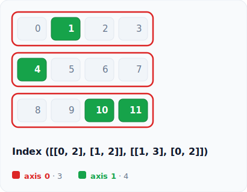

`rt.index(np.arange(12).reshape(3, 4), (np.array([True, False, True]), slice(None)))`

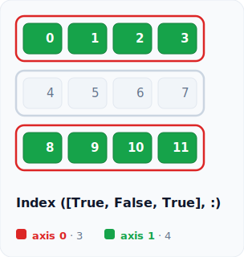

The same view also renders in a dark theme.

`rt.shape(np.arange(8).reshape(2, 2, 2), theme="dark")`


Shape changing, combining, and broadcasting views draw the source and the result side by side.

`rt.reshape((2, 3), (3, 2))`

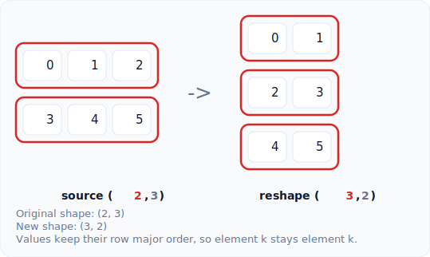

`rt.transpose((2, 3))`

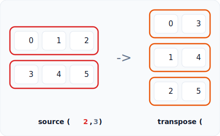

`rt.sum((3, 4), 0)`


`rt.mean((3, 4), 1)`

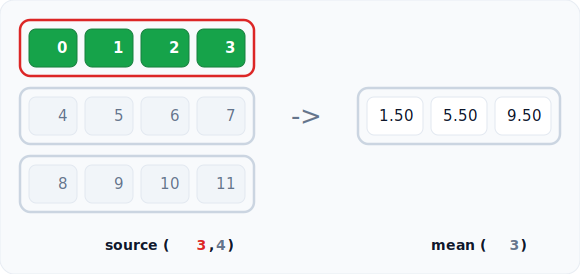

`rt.concatenate([(2, 3), (2, 3)], 0)`

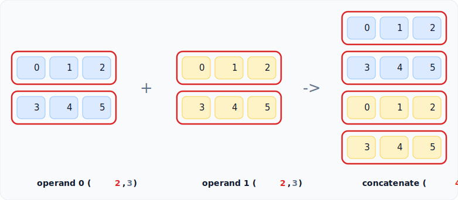

`rt.stack([(2, 3), (2, 3)], 0)`

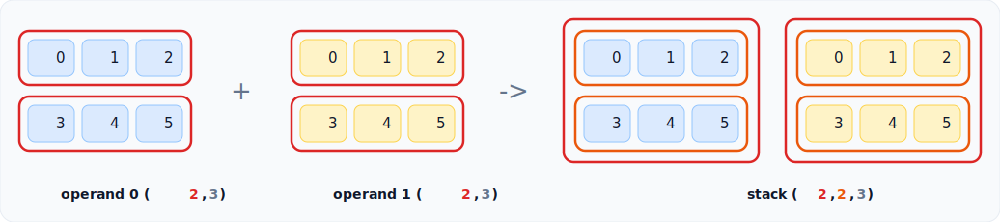

`rt.broadcast((3, 1), (1, 4))`

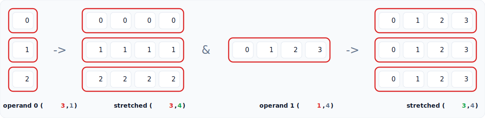

`rt.einsum("ij,jk->ik", np.arange(6).reshape(2, 3), np.arange(12).reshape(3, 4))`


`rt.einsum("...ij,...jk->...ik", np.arange(12).reshape(2, 2, 3), np.arange(24).reshape(2, 3, 4))`

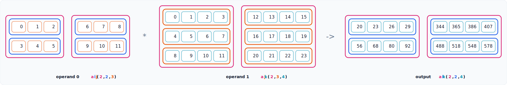

`rt.swapaxes(np.arange(24).reshape(2, 3, 4), 0, 2)`

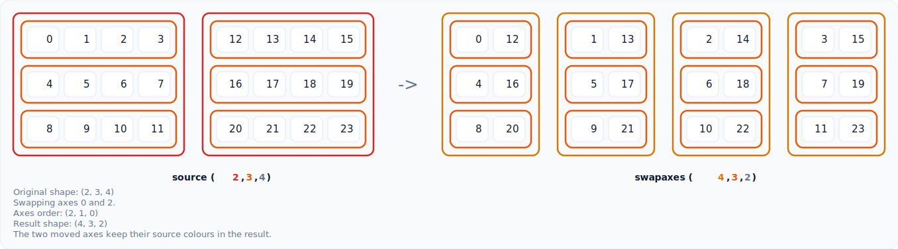

`rt.shape((100, 100, 100, 100))`

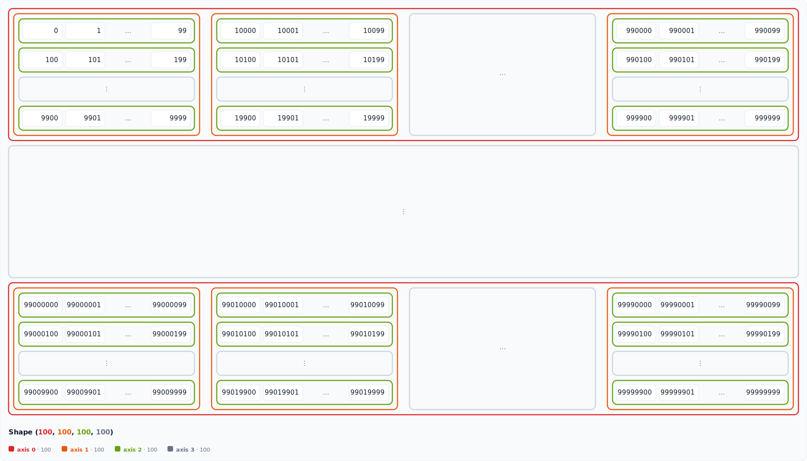

The same calls work with backend arrays that expose a shape and coordinate access.

`rt.shape(np.arange(6).reshape(2, 3))`

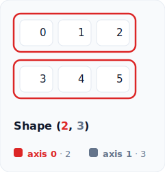

More sample images live in `examples/images`, and runnable notebooks live in `examples`.

## Features

- Static SVG output that stays sharp at any zoom level in a notebook
- Shape visualisation for tensors of any rank, nesting frames to arbitrary depth
- Index visualisation with highlighted selections and a plain text explanation, including boolean masks and integer array indexing
- Explanation lines print as standard output in notebooks and stay available as `visual.text`
- Shape changing views for reshape, transpose, and axis reductions, drawing the source and the result side by side
- Swapaxes views that move two axes while keeping the source colours traceable
- Combining views for concatenate and stack, tinting each operand so the seam or the new axis is clear
- Broadcasting views that stretch a smaller operand to match a larger one, marking every stretched axis
- Einsum views that colour each label by its role so free, shared, and contracted labels stay distinct and consistent across every panel, and show the derived output shape
- Backend value access for NumPy style arrays plus Torch, JAX, and TensorFlow style scalar values
- A renderer registry with SVG as the default output backend
- A light theme and a dark theme, selectable per call or through a module default
- A global axis colour scheme, set once with `set_default_axis_colors` and overridable by a per call theme
- An axis legend that names each axis with its size in the matching colour
- Configurable float precision with right aligned numbers
- Long axes truncate to a readable head and tail with an ellipsis cell
- Big tensor previews respect a total visible cell budget, and selected positions are kept visible when there is room
- Hover any cell to read its coordinate and flat index
- A `save` helper that writes the SVG to a file
- Works with shape tuples and with array-like objects that expose a `.shape` attribute, such as NumPy arrays
- No tensor library is imported by the core, so the package stays lightweight

## Colour scheme

Each axis has its own colour drawn from a rainbow ramp keyed by depth, so the structure and a selection are easy to read.

- Axis 0 is the outer frame, drawn red
- Axis 1 is the inner row frame, drawn orange
- Deeper axes jump to lime and teal, then continue through blue, violet, and pink, so adjacent axes are easy to tell apart
- The leaf axis elements sit in plain cells, and a selected element fills green
- The numbers in the shape label, the tokens in the index label, and the legend swatches are coloured to match

In an index view only the selected frames keep their axis colour. The rest of the tensor is dimmed so the selected path stands out.

## Themes

Pass `theme="light"` or `theme="dark"` to any call, or set a module default that every later call follows.

```python
import numpy as np
import rainbow_tensor as rt

x = np.arange(8).reshape(2, 2, 2)
rt.shape(x, theme="dark")

rt.set_default_theme("dark")
rt.index(x, (0, slice(None), 1))
```

A theme bundles the colours, fonts, cell size, stroke width, the per axis truncation limit, and the total visible cell budget. Derive a tweaked copy with `variant` and pass it directly.

```python
roomy = rt.LIGHT.variant(cell_w=64, max_cells=8, max_visible_cells=160)
rt.shape(np.arange(8).reshape(2, 4), theme=roomy)
```

## Global colour scheme

To recolour the axis frames everywhere without building a whole theme, set an axis colour ramp once with `set_default_axis_colors`. Each colour maps to one axis depth, and the ramp wraps for tensors deeper than it. It applies to every later call that does not pass its own `theme`, so a per call `theme` still wins.

```python
import rainbow_tensor as rt

rt.set_default_axis_colors(["#2563eb", "#db2777", "#16a34a"])
rt.shape((2, 2, 2))                 # uses the new ramp
rt.shape((2, 2, 2), theme="dark")   # the per call theme keeps its own ramp

rt.set_default_axis_colors(None)    # clear it and fall back to the theme ramp
```

`get_default_axis_colors` returns the current ramp, or `None` when none is set.

## Float precision and saving

Control how floats are formatted with `precision`, then write the SVG to a file with `save`.

```python
import numpy as np
import rainbow_tensor as rt

x = np.linspace(0, 1, 6).reshape(2, 3)
visual = rt.shape(x, precision=3)
visual.save("tensor.svg")
```

## Shape changing operations

Beyond viewing a single tensor, rainbow-tensor draws the operations that rearrange or summarise one. Each view places the source and the result in one figure with a connector, so the mapping is easy to follow.

```python
import numpy as np
import rainbow_tensor as rt

x = np.arange(12).reshape(3, 4)

rt.reshape(x, (2, 6))      # the same values flow into a new layout
rt.transpose(x)            # axes reverse, each keeping its colour
rt.transpose(x, (1, 0))    # an explicit permutation
rt.swapaxes(x.reshape(2, 3, 2), 0, 2)   # swap exactly two axes
rt.squeeze(x.reshape(1, 3, 4, 1))       # drop the size one axes
rt.expand_dims(x, 1)                     # insert a size one axis at position 1
rt.sum(x, 0)               # collapse axis 0, the result keeps the rest
rt.mean(x, 1)              # collapse axis 1 into per group means
```

`reshape` keeps the row major order, so element k stays element k. A single `-1` lets one axis be inferred. `transpose` colours each result axis by the source axis it came from, so a colour can be traced across the move. `swapaxes` does the same for two chosen axes. `squeeze` removes size one axes, with no axis for every size one axis or an explicit axis or tuple for chosen ones, and marks the removed axes while each surviving axis keeps its colour. `expand_dims` inserts a size one axis at a positive or negative position and marks the inserted axis in the accent colour. `sum` and `mean` give the source values that fold into the same result element one shared background with that result element, highlight the first group, and draw the surviving shape, so a reduction reads like the concatenate and stack views.

## Combining tensors

`concatenate` and `stack` join several operands into one. Each operand is drawn in its own tint, and the result colours every cell by the operand it came from, so the seam between operands or the new axis stays clear.

```python
import numpy as np
import rainbow_tensor as rt

a = np.arange(6).reshape(2, 3)
b = np.arange(100, 106).reshape(2, 3)

rt.concatenate([a, b], 0)   # join along an existing axis, (4, 3)
rt.concatenate([a, b], 1)   # grow the columns instead, (2, 6)
rt.stack([a, b], 0)         # place onto a new leading axis, (2, 2, 3)
```

`concatenate` needs the operands to match on every axis except the joined one, while `stack` needs them to share one shape. A mismatch raises a clear error rather than drawing a wrong figure.

## Broadcasting

`broadcast` stretches a smaller operand to match a larger one. Each operand is drawn in its own shape and again stretched to the common broadcast shape, so the repeated values along a stretched axis are visible, and every stretched axis is marked in the accent colour.

```python
import numpy as np
import rainbow_tensor as rt

a = np.arange(3).reshape(3, 1)
b = np.arange(4).reshape(1, 4)

rt.broadcast(a, b)          # (3, 1) and (1, 4) stretch to (3, 4)
rt.broadcast((2, 3, 4), (4,))   # a (4,) vector gains two leading axes
```

Axes line up from the right, and on each axis the sizes must be equal or one of them must be `1`. Incompatible shapes raise a clear error rather than drawing a wrong figure.

## Einsum

`einsum` turns a subscript expression into labelled operand panels and an output panel. Every label is coloured by its role, so free, shared, and contracted labels read as three distinct groups, and a label keeps that colour across every operand caption, operand figure, and the output.

```python
import numpy as np
import rainbow_tensor as rt

a = np.arange(6).reshape(2, 3)
b = np.arange(12).reshape(3, 4)

rt.einsum("ij,jk->ik", a, b)
rt.einsum("abc,cde,ef->abdf", (2, 2, 2), (2, 2, 2), (2, 2))
rt.einsum("...ij,...jk->...ik", (2, 2, 3), (2, 3, 4))   # ellipsis for batch axes
```

A non-leaf axis shows its label colour as a frame and a leaf axis shows it as the cell border, so the figure colours always match the caption colours. The output shape is derived from the free labels in the output subscript and checked with the same size rules as NumPy. Ellipsis notation (`...`) stands for the broadcast axes a subscript leaves unnamed, expanded against the operand shapes and aligned from the right like NumPy, with both implicit and explicit output supported.

## Big tensor previews

Large tensors use two limits. `max_cells` limits one axis, while `max_visible_cells` caps the whole preview so a high rank tensor does not create a huge SVG.

```python
import rainbow_tensor as rt

rt.shape((100, 100, 100, 100))
rt.index((100,), (50,))
```

The preview keeps the head and tail of hidden axes. A selected position in a long axis is pinned into the preview when the budget allows it.

## Standard output explanations

The SVG now stays focused on the figure. Explanation lines are printed as normal notebook output under the image, and the same text is available in Python.

```python
visual = rt.index((2, 2, 2), (0, slice(None), 1))
visual.text
```

## Backend arrays

rainbow-tensor keeps using duck typing for arrays. If an object exposes a `.shape` attribute and supports coordinate reads, the visualiser can draw its values without importing that backend in the core package.

```python
import rainbow_tensor as rt
import torch
import jax.numpy as jnp

rt.shape(torch.arange(6).reshape(2, 3))
rt.shape(jnp.arange(6).reshape(2, 3))
```

Torch, JAX, and TensorFlow checks are optional in the test suite. They run when those packages are installed and skip cleanly otherwise.

## Renderer registry

SVG is still the default renderer. A custom renderer can be registered for experiments with other output formats. It receives the same tensor shape, panel dictionaries, value functions, theme, and precision that the SVG renderer uses.

```python
import rainbow_tensor as rt


class TextRenderer:
    name = "text"
    mime_type = "text/plain"

    def render_tensor(self, **kwargs):
        return str(kwargs["shape"])

    def render_panels(self, **kwargs):
        return str(kwargs["panels"][-1]["shape"])


rt.register_renderer(TextRenderer())
rt.shape((2, 3), renderer="text")
```

Use `set_default_renderer` to choose a renderer for later calls, or pass `renderer=` on one call when you only want a local override.

## Installation

Install from PyPI.

```bash
pip install rainbow-tensor
```

Install from source for development.

```bash
git clone https://github.com/Niox1337/rainbow-tensor.git
cd rainbow-tensor
pip install -e .
```

Install with the development tools (pytest, ruff, build).

```bash
pip install -e ".[dev]"
```

The distribution name is `rainbow-tensor` and the import name is `rainbow_tensor`.

## Usage

Run the examples in a Jupyter notebook or an IPython shell so the SVG is displayed.

The convention is to import the package as `rt`.

Visualise a shape.

```python
import numpy as np
import rainbow_tensor as rt

x = np.arange(8).reshape(2, 2, 2)
rt.shape(x)
```

Visualise how an index selects elements.

```python
rt.index(x, (0, slice(None), 1))
```

For the array `np.arange(8).reshape(2, 2, 2)` the index `(0, slice(None), 1)` selects the values `1` and `3`, the selected coordinates are `(0, 0, 1)` and `(0, 1, 1)`, and the result shape is `(2,)`.

Each function returns a small result object. Its `svg` attribute holds the SVG string, and its `text` attribute holds the explanation printed below the figure in notebooks.

## Supported

- Tensors of any rank, with frames nested to arbitrary depth
- Big tensor previews with a total visible cell budget
- Shape tuples and array-like objects with a `.shape` attribute
- Integer indexing, including negatives such as `-1`
- Basic slicing with `slice(None)`, `slice(start, stop)`, and `slice(start, stop, step)`, including negative bounds and steps such as `slice(None, None, -1)`
- `Ellipsis` (`...`) to fill the remaining axes, such as `(0, ..., 1)`
- `None` (newaxis) to insert a size 1 axis, shown in the result shape and label
- A full-shape boolean mask, highlighting every True position
- Per-axis boolean arrays on one or more consecutive axes, acting like their nonzero integer arrays and mixing with slices and integer indices
- Integer array (fancy) indexing, including multi-dimensional index arrays that broadcast together, mixed with slices, with the gathered block placed as NumPy does
- Reshape with row major order and one inferred `-1` axis
- Transpose and permute with axis colours following the move
- Swapaxes with negative axes resolved like NumPy
- Sum and mean reductions over a chosen axis
- Concatenate along an existing axis, with the seam tinted
- Stack onto a brand new axis
- Broadcasting two tensors to a common shape, marking every stretched axis
- Einsum with explicit or implicit output labels, ellipsis notation for broadcast axes, and any number of operands
- Backend arrays with `.shape` and coordinate access, including optional Torch, JAX, and TensorFlow checks
- Custom renderers through the renderer registry
- Standard output explanation text through `TensorVisual.text`

## Not supported yet

- Interactive controls and animation

## Development

```bash
pytest
ruff check .
python -m build
```

## License

MIT
