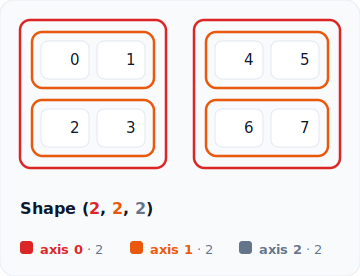
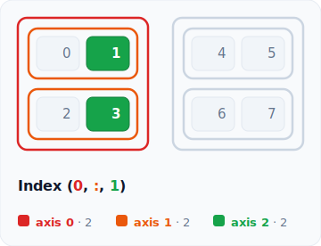
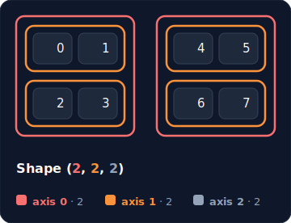

# rainbow-tensor

Visualise tensor shape, indexing, and slicing as SVG inside IPython and Jupyter notebooks.

rainbow-tensor is made for people who are learning how a tensor is structured and how an indexing expression selects elements. It draws the tensor as nested blocks, rows, and cells, then highlights exactly which elements an index picks out.

## Examples

`rt.shape(np.arange(8).reshape(2, 2, 2))`



`rt.index(np.arange(8).reshape(2, 2, 2), (0, slice(None), 1))`



The same view also renders in a dark theme.

`rt.shape(np.arange(8).reshape(2, 2, 2), theme="dark")`



More sample images live in `examples/images`, and runnable notebooks live in `examples`.

## Features

- Static SVG output that stays sharp at any zoom level in a notebook
- Shape visualisation for 1D, 2D, and 3D tensors
- Index visualisation with highlighted selections and a plain text explanation
- A light theme and a dark theme, selectable per call or through a module default
- An axis legend that names each axis with its size in the matching colour
- Configurable float precision with right aligned numbers
- Long axes truncate to a readable head and tail with an ellipsis cell
- Hover any cell to read its coordinate and flat index
- A `save` helper that writes the SVG to a file
- Works with shape tuples and with array-like objects that expose a `.shape` attribute, such as NumPy arrays
- No tensor library is imported by the core, so the package stays lightweight

## Colour scheme

Each axis has its own colour drawn from a rainbow ramp keyed by depth, so the structure and a selection are easy to read.

- Axis 0 is the outer frame, drawn red
- Axis 1 is the inner row frame, drawn orange
- Deeper axes continue through amber, green, blue, violet, and pink
- The leaf axis elements sit in plain cells, and a selected element fills green
- The numbers in the shape label, the tokens in the index label, and the legend swatches are coloured to match

In an index view only the selected frames keep their axis colour. The rest of the tensor is dimmed so the selected path stands out.

## Themes

Pass `theme="light"` or `theme="dark"` to any call, or set a module default that every later call follows.

```python
import numpy as np
import rainbow_tensor as rt

x = np.arange(8).reshape(2, 2, 2)
rt.shape(x, theme="dark")

rt.set_default_theme("dark")
rt.index(x, (0, slice(None), 1))
```

A theme bundles the colours, fonts, cell size, stroke width, and the truncation limit. Derive a tweaked copy with `variant` and pass it directly.

```python
roomy = rt.LIGHT.variant(cell_w=64, max_cells=8)
rt.shape(np.arange(8).reshape(2, 4), theme=roomy)
```

## Float precision and saving

Control how floats are formatted with `precision`, then write the SVG to a file with `save`.

```python
import numpy as np
import rainbow_tensor as rt

x = np.linspace(0, 1, 6).reshape(2, 3)
visual = rt.shape(x, precision=3)
visual.save("tensor.svg")
```

## Installation

Install from PyPI.

```bash
pip install rainbow-tensor
```

Install from source for development.

```bash
git clone https://github.com/Niox1337/rainbow-tensor.git
cd rainbow-tensor
pip install -e .
```

Install with the development tools (pytest, ruff, build).

```bash
pip install -e ".[dev]"
```

The distribution name is `rainbow-tensor` and the import name is `rainbow_tensor`.

## Usage

Run the examples in a Jupyter notebook or an IPython shell so the SVG is displayed.

The convention is to import the package as `rt`.

Visualise a shape.

```python
import numpy as np
import rainbow_tensor as rt

x = np.arange(8).reshape(2, 2, 2)
rt.shape(x)
```

Visualise how an index selects elements.

```python
rt.index(x, (0, slice(None), 1))
```

For the array `np.arange(8).reshape(2, 2, 2)` the index `(0, slice(None), 1)` selects the values `1` and `3`, the selected coordinates are `(0, 0, 1)` and `(0, 1, 1)`, and the result shape is `(2,)`.

Each function returns a small result object. Its `svg` attribute holds the SVG string, so the package can be inspected and tested outside a notebook.

## Supported

- 1D, 2D, and 3D tensors
- Shape tuples and array-like objects with a `.shape` attribute
- Integer indexing, including negatives such as `-1`
- Basic slicing with `slice(None)`, `slice(start, stop)`, and `slice(start, stop, step)`, including negative bounds and steps such as `slice(None, None, -1)`
- `Ellipsis` (`...`) to fill the remaining axes, such as `(0, ..., 1)`
- `None` (newaxis) to insert a size 1 axis, shown in the result shape and label

## Not supported yet

- Advanced NumPy indexing
- Boolean masks
- 4D or higher tensors
- Interactive controls and animation

## Development

```bash
pytest
ruff check .
python -m build
```

## License

MIT
