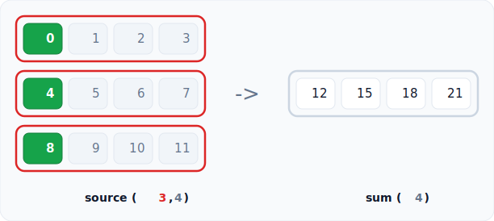
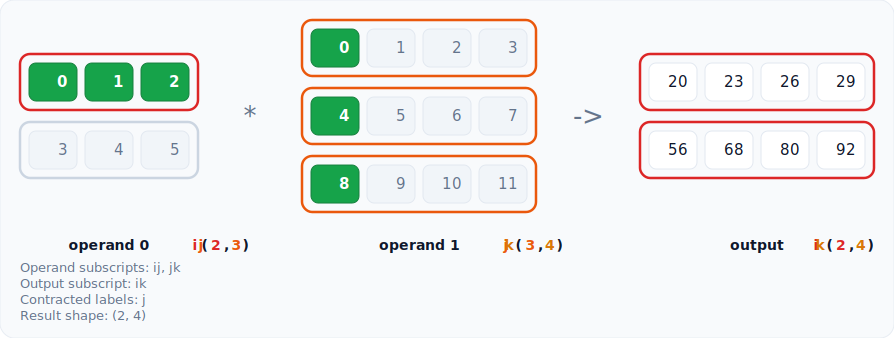

# rainbow-tensor

Colourful SVG visuals for tensor shapes, indexing, and operations, built for Jupyter notebooks and teaching.

[](https://pypi.org/project/rainbow-tensor/)
[](https://pypi.org/project/rainbow-tensor/)
[](https://github.com/Niox1337/rainbow-tensor/blob/main/LICENSE)
[](https://rainbow-tensor.zhixiangfeng.com/)

```python
rt.shape(np.arange(8).reshape(2, 2, 2))
```


## Why rainbow-tensor

Tensor shapes are hard to hold in your head, and an index like `(0, slice(None), 1)` gives no hint of what it selects until you run it. A printed array is just a wall of numbers. rainbow-tensor draws the tensor as nested coloured frames and highlights exactly which elements an operation touches, so the structure and the result are clear at a glance.

Every axis keeps one colour through every view, so you can follow an axis as it moves, folds, or stretches. That makes it a fast way to learn how reshapes and reductions work, to teach shape transformations, and to debug a confusing indexing or broadcasting bug. The core imports no deep learning framework, so it stays light and works with plain NumPy or any array that exposes a shape.

## Install

```bash
pip install rainbow-tensor
```

The distribution name is `rainbow-tensor` and the import name is `rainbow_tensor`.

## Quick start

Run inside a Jupyter notebook or an IPython shell so the SVG is displayed. The convention is to import the package as `rt`.

```python
import numpy as np
import rainbow_tensor as rt

x = np.arange(8).reshape(2, 2, 2)

rt.shape(x)                          # draw the structure
rt.index(x, (0, slice(None), 1))     # highlight what an index selects
```


Each call returns a small result object. Its `svg` attribute holds the SVG string, its `text` attribute holds the explanation printed under the figure, and `save` writes the SVG to a file.

## What it can show

Shape changing, combining, and broadcasting views draw the source and the result side by side, so the mapping between them is easy to follow.

- **Shapes and indexing** with `shape` and `index`, covering integers, slices, ellipsis, new axes, boolean masks, and fancy integer arrays
- **Reshaping and moving axes** with `reshape`, `transpose`, `swapaxes`, `moveaxis`, `squeeze`, and `expand_dims`
- **Reductions and math** with `sum`, `mean`, `matmul`, and `einsum`
- **Combining** with `concatenate`, `stack`, `broadcast`, `repeat`, and `take`

```python
rt.sum(np.arange(12).reshape(3, 4), 0)
```



```python
rt.einsum("ij,jk->ik", np.arange(6).reshape(2, 3), np.arange(12).reshape(3, 4))
```



## Themes

Pass `theme="dark"` to any call, or set a module default that every later call follows. A theme is a plain object you can tweak with `variant`, and a global axis ramp can be set once with `set_default_axis_colors`.

```python
rt.shape(x, theme="dark")
rt.set_default_theme("dark")
```

## Documentation

The full guide and API reference live at [rainbow-tensor.zhixiangfeng.com](https://rainbow-tensor.zhixiangfeng.com/).

Runnable notebooks for every feature group live in [`examples`](examples), and more sample images live in [`examples/images`](examples/images).

## Development

```bash
pip install -e ".[dev]"
pytest
ruff check .
python -m build
```

## License

MIT
